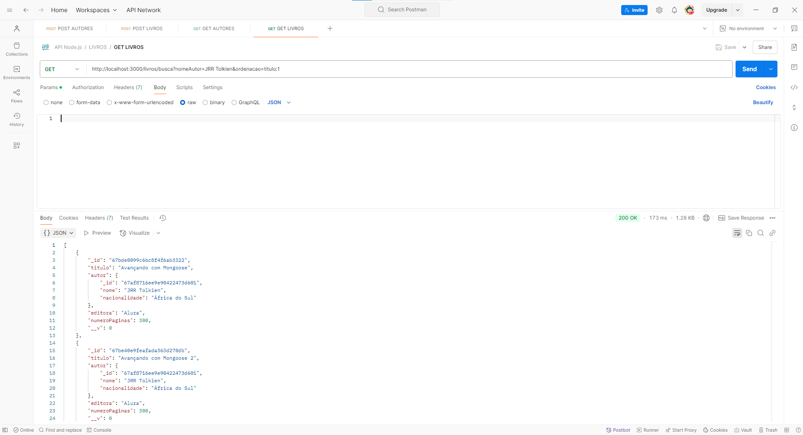

# 2404-api-node-express
Projeto utilizado no curso da Alura
# api-livraria-node-js

# Essa API é destinada a quem está iniciando seus estudos em back-end e escolheu o JavaScript como linguagem, utilizando o Node.js. A API foi desenvolvida juntamente com instrutores da Alura através da formação APIs com Node.js e Express

## Índice
1. [O que eu aprendi ao desenvolver essa API?](#o-que-eu-aprendi)
2. [Motivação](#motivação)
3. [Tópicos da primeira parte da formação](#topicos-da-primeira-parte-da-formacao)
4. [Tópicos da segunda parte da formação](#topicos-da-segunda-parte-da-formacao)
5. [Tecnologias Utilizadas](#tecnologias-utilizadas)
6. [Agradecimentos](#Agradecimentos)

## O que eu aprendi ao desenvolver essa API?
Ao desenvolver essa API, eu aprendi mais sobre APIs, sua importância e o papel das APIs no desenvolvimento web.
Essa API foi criada com algumas ferramentas muito utilizadas no mercado, como o Express e o MongoDB, em conjunto com o Node.js.
Trabalhei também com bancos de dados. Entendi alguns tipos existentes e integrei a API a um banco de dados MongoDB.
Apendi mais sobre algumas partes principais de uma API REST, como, por exemplo, as rotas, os modelos e os controladores.

## Motivação
Projeto desenvolvido com o intuito de aprimorar meus conhecimentos e me desenvolver na área da programação. Acredito que, ao investir tempo e esforço no estudo contínuo, poderei evoluir minhas habilidades técnicas e contribuir de forma significativa para projetos desafiadores e inovadores.

## Tópicos da primeira parte da formação
### 01 - Criando o projeto com Node.js
#### Neste tópico eu aprendi:
- O que são APIs, seus diferentes tipos, para que são utilizadas e como vai funcionar a API no contexto do nosso produto.
- O que são servidores e como criar um servidor local utilizando o módulo http nativo do Node.js.
- Como criar rotas em uma API, como se conectar e acessar rotas e de que forma as rotas são utilizadas dentro da lógica de uma API REST.

### 02 - Express e primeiras rotas
#### Neste tópico eu aprendi:
- Como instalar e utilizar os métodos do framework Express para criação de um servidor HTTP e também para gerenciamento de requisições, respostas e criação de rotas;
- Como implementar um CRUD inicial com os métodos HTTP GET, POST, PUT e DELETE, e como utilizar os métodos do Express para cada método;
- Como testar requisições com Postman e quais são as partes de uma requisição HTTP;
- Como utilizar o Express para gerar e enviar respostas adequadas para cada tipo de requisição HTTP.

### 03 - Evoluindo a API
#### Neste tópico eu aprendi:
- A organizar a estrutura do código de um projeto de API utilizando o padrão chamado controller;
- A evoluir as funcionalidades da API organizando as chamadas da lib Mongoose em métodos separados em um controller;
- A praticar a implementação do CRUD (Create, Read, Update e Delete) com as respostas HTTP e as rotas correspondentes.

### 04 - Adicionando funcionalidades
#### Neste tópico eu aprendi:
- A evoluir as funcionalidades de uma API, unindo diferentes entidades como livro e autor;
- Como funciona o relacionamento em um banco de objetos como MongoDB utilizando o modelo de embedding;
- Como realizar buscas em API via parâmetros de query.

## Tópicos da segunda parte da formação
### 01 - Deixando a API resiliente
#### Neste tópico eu aprendi:
- Proteger informações sensíveis com o dotenv

###### Aprendi a usar o dotenv para configurar variáveis de ambiente no projeto. Criei um arquivo .env para guardar a string de conexão do MongoDB Atlas, que é uma informação sensível, pois não quero que qualquer pessoa tenha acesso ao banco de dados da aplicação.

- Configurar o ESLint para formatar o código e identificar bugs:

###### O ESLint nos ajuda a manter a padronização de formatação de arquivos, o que favorece equipes que trabalham em um mesmo projeto. Além disso, a extensão ESLint alerta sobre erros de código que normalmente não seriam alertados, auxiliando nosso desenvolvimento.

- Refatorar o código com async/await:

###### Removi o uso de funções callback nos métodos do Mongoose que interagem com o banco de dados e troquei pelo uso de async/await, em conjunto com o try...catch. Além do código se tornar mais legível, existem casos em que esse padrão irá nos auxiliar, como por exemplo realizar mais de uma operação no banco de dados no mesmo método de controlador.

- Identificar e tratar erros específicos de uma rota:

###### Na rota de buscar um autor pelo seu ID, identificamos os casos em que: o dado foi fornecido de forma incorreta (código de status 400); o dado foi fornecido de forma correta, mas não havia nenhuma correspondência no banco de dados (código de status 404); e o caso de erro interno de servidor, que é retornado quando o erro não foi identificado como nenhum dos outros casos (código de status 500).

### 02 - Avançando o tratamento de erros
#### Neste tópico eu aprendi:
- Criar e utilizar um middleware de manipulador de erros:

###### Esse middleware é caracterizado por receber quatro parâmetros, convencionalmente chamados de: erro, req, res e next. Foi nele que centralizei o tratamento da maioria dos erros que poderiam acontecer na aplicação, possibilitando a reutilização de código. E, de acordo com o erro recebido, ele pode encerrar o fluxo de requisição ao enviar uma resposta de erro padronizada para o cliente, utilizando o objeto res.

- Identificar e tratar erros de validação:

###### É possível identificar um erro de validação do Mongoose ao verificar se o erro é uma instância de mongoose.Error.ValidationError. Também aprendemos como personalizar as mensagens de validação nos Schemas do Mongoose e como obtê-las no objeto de erro.

- Refatorar o manipulador de erros utilizando classes:

###### Nos aproveitamos dos conceitos da orientação a objetos para criar classes para cada erro, reduzindo o código e tornando-o mais legível.

- Criar um middleware para tratar páginas 404:

###### Esse middleware deve ser registrado após todas as outras rotas da aplicação. Assim, se nenhuma das rotas registradas tiver sido correspondida, o código desse middleware será executado. Em seguida, nele podemos criar um erro (no nosso caso, uma nova instância da classe NaoEncontrado) e enviá-lo para o manipulador de erros.

### 03 - Avançando em buscas e filtros
#### Neste tópico eu aprendi:
- Buscar pelos títulos dos livros de forma dinâmica:

###### Para isso, podemos utilizar expressões regulares (ou regex) para tornar a busca por texto dinâmica. Isso pode ser feito passando diretamente uma expressão regular do JavaScript para o objeto de busca ou podemos utilizar os operadores de busca $regex e $options do MongoDB. Ambas as formas permitem que o valor a ser buscado venha de uma variável e que a flag i seja aplicada para que não haja distinção entre letras maiúsculas e minúsculas na busca.

- Filtrar os livros por número de páginas:

###### Utilizamos os operadores de busca $gte (greater than or equal, que significa “maior ou igual que”) e $lte (less than or equal, que significa “menor ou igual que”) para definir, respectivamente, o número mínimo de páginas e o número máximo de páginas que um livro deve ter.

- Buscar livros pelo nome do autor:

###### Como o nome do autor não é uma informação presente na coleção de livros, foi necessário realizar mais uma consulta para a coleção de autores, pois lá é possível obter seu id e realizar corretamente o filtro na busca de livros.

### 04 - Implementando paginação
#### Neste tópico eu aprendi:
- Paginar uma rota:

###### Para isso, aplicamos o método skip para pular a quantidade de registros necessários para a página solicitada e o método limit para limitar os resultados exibidos em uma única página.

- Ordenar os resultados:

###### Com o método sort podemos ordenar os resultados de acordo com algum campo da coleção. Por exemplo, é possível ordenar o _id de forma decrescente para obter primeiro os registros mais recentes ou ordenar um campo de texto de forma crescente para retornar os registros em ordem alfabética.

- Reutilizar a lógica de paginação em um middleware:

###### Mais uma vez utilizamos os middlewares do Express para reutilizar lógica em nossa aplicação. Criamos um middleware chamado paginar e o registramos nas rotas GET /livros, GET /livros/busca e GET /autores.

- Compartilhar informações entre middlewares:

###### Para isso, podemos utilizar o objeto de requisição req. No caso dessa API, guardamos as buscas do Mongoose em req.resultado para que o middleware de paginação pudesse acessá-las. Assim, ele pode aplicar os métodos sort, skip e limit na busca para realizar a paginação e retornar os resultados.

## Tecnologias Utilizadas 

## Agradecimentos
# Olá! 🎉

### **Muito obrigado por visitar e utilizar este repositório**

### Fico extremamente feliz em saber que ele foi útil para você ou que você gostou do conteúdo aqui disponível. Se este projeto te ajudou de alguma forma ou se você achou interessante, por favor, considere dar uma ⭐️ ao repositório. Seu apoio é muito importante e me motiva a continuar melhorando e criando mais conteúdos úteis para a comunidade. Agradeço imensamente pela colaboração e pelo tempo dedicado. Se tiver qualquer dúvida ou sugestão, sinta-se à vontade para abrir uma issue ou entrar em contato. Adoraria ouvir o seu feedback!
